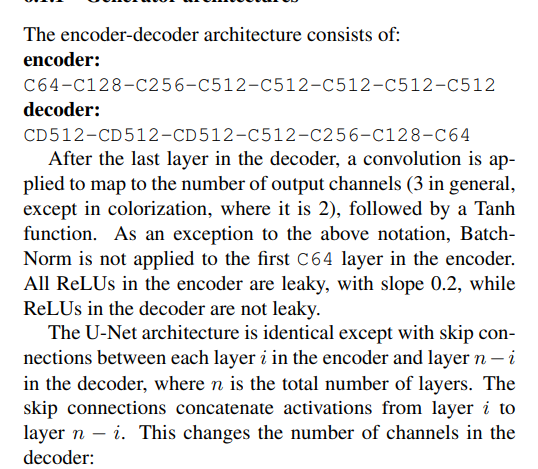
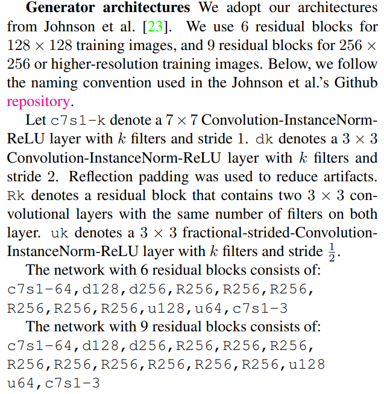
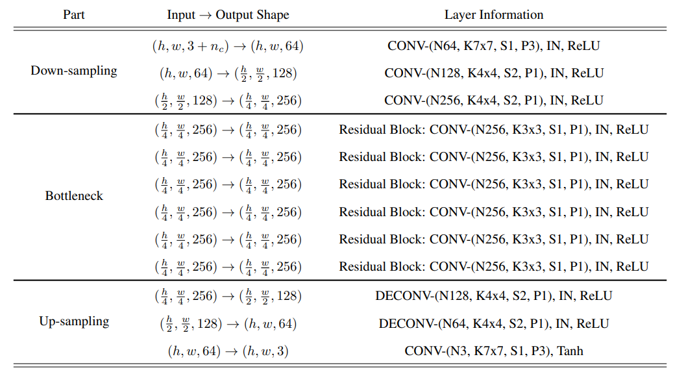
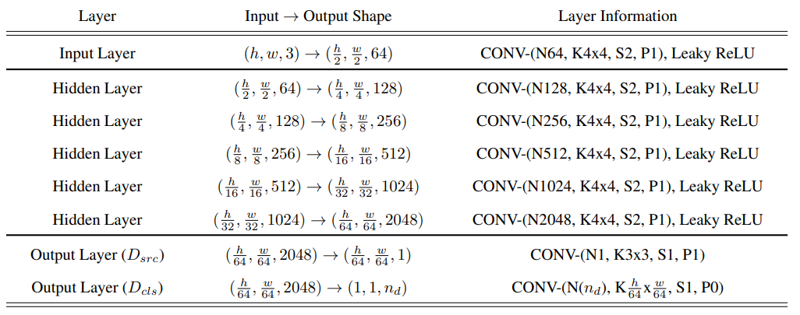

# de-i2i-gan
data efficient GAN for image-to-image translation

# architecture
The major architecture of G mainly follows the commonly used image-to-image translation networks, which first encodes the input image by a stride of 4, and then decodes it to its original size.

(pix2pix, cycle-GAN, star-GAN)




[Style-Gan github](https://github.com/yunjey/stargan)  
To improve synthesis realism and diversity for defect generation, we specifically design spatial and categorical control, stochastic variation and layer-based composition for G.
```angular2html
My thoughts
base on star-GAN
7k1s 4k2s 4k2s  3k1s..... 4k1su 4k1su 3k1s
3-64-128-256-256-256-256-256-256-128-64-3
  |   |   |   |   |   |   |   |   |  | 
  |   |   |   |   |---|   |   |   |  | 
  |   |   |   |-----------|   |   |  | 
  |   |   |-------------------|   |  | 
  |   |------------skip-----------|  |
  |----------------skip--------------|
1. add skip connection
2. maybe add SPADE
3. use leaky relu with 0.2 in encoder, relu in decoder
4. instanceNorm instead of BatchNorm
5. TTUR
6. SpectralNorm Of course
7. use res-blk in spade
```
The network architecture of D is the same as StarGAN, which includes a D src to distinguish faked samples from real ones using PatchGAN and a D cls to predict the categories of generated defect.

(star-GAN)

i.e.,Ais acquired by spatial-wisely repeating the target de-fect labelc∈RC. This restriction can be lifted duringinference stage, which enables Defect-GAN to add defectsat different location(s) in a context-compatible mann

# loss
GAN-loss  
cls-loss  
reconstruction-loss  
spatial distribution loss  
(md <-> md~), (mn <-> mn~)  
spatial distribution L1-loss  
(md,mn <-> 0)  
LD = gan + a*cls  
LG = gan + b*cls + c*rec + d*sd + e*sdl1  
(a, b, c, d, e) -> (2, 5, 5, 5, 1)  